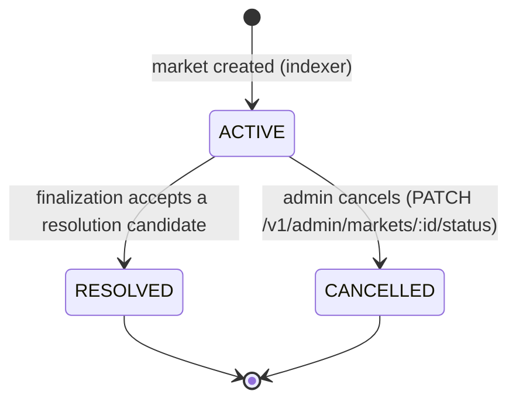

# Market lifecycle

`packages/shared/src/marketLifecycle.ts` is the **only** place the market status
matrix is encoded. API routes, the oracle, the indexer and the finalization
worker import it rather than writing their own status comparisons, so a change
to the lifecycle is a one-file change.

## State diagram

`RESOLVED` and `CANCELLED` are terminal; self-transitions are illegal.

## Matrix

| From        | Allowed successors     | Tradable | Resolvable |
| ----------- | ---------------------- | -------- | ---------- |
| `ACTIVE`    | `RESOLVED`,`CANCELLED` | yes      | yes        |
| `RESOLVED`  | –                      | no       | no         |
| `CANCELLED` | –                      | no       | no         |

## Enforcement points

| Path                                           | Guard                                            | Behaviour on violation                                 |
| ---------------------------------------------- | ------------------------------------------------ | ------------------------------------------------------ |
| `PATCH /v1/admin/markets/:id/status`           | `canTransition(current, next)`                   | `409` with code `market_invalid_transition`            |
| Order placement (`src/matching/validation.ts`) | `isTradable(market.status)`                      | `400 validation_error` — orders cannot be placed       |
| Oracle scheduling (`apps/oracle/main.ts`)      | `RESOLVABLE_MARKET_STATUSES` in the market query | market is skipped, no submission enqueued              |
| Finalization (`apps/workers/src/finalization`) | `RESOLVABLE_MARKET_STATUSES` on select + update  | candidate is not eligible; update is a safe no-op      |
| Indexer market-created parser                  | `isMarketStatus` + `isInitialStatus`             | non-initial status in the event falls back to `ACTIVE` |

Workers and the indexer fail safe (skip / no-op) rather than throwing, so a
replayed or out-of-order event can never move a market backwards.

## API error codes

| Code                        | HTTP | Meaning                                                  |
| --------------------------- | ---- | -------------------------------------------------------- |
| `market_invalid_transition` | 409  | Requested status is not a legal successor of the current |
| `market_not_tradable`       | –    | Shared code for non-tradable market guards               |
