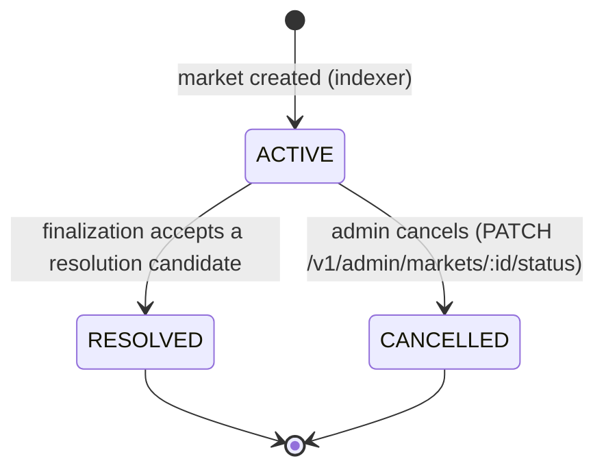

# Market lifecycle

`packages/shared/src/marketLifecycle.ts` is the **only** place the market status
matrix is encoded. API routes, the oracle, the indexer and the finalization
worker import it rather than writing their own status comparisons, so a change
to the lifecycle is a one-file change.

## State diagram

`RESOLVED` and `CANCELLED` are terminal; self-transitions are illegal.

## Matrix

| From        | Allowed successors     | Tradable | Resolvable |
| ----------- | ---------------------- | -------- | ---------- |
| `ACTIVE`    | `RESOLVED`,`CANCELLED` | yes      | yes        |
| `RESOLVED`  | –                      | no       | no         |
| `CANCELLED` | –                      | no       | no         |

## Enforcement points

| Path                                                 | Guard                                                                             | Behaviour on violation                                                                           |
| ---------------------------------------------------- | --------------------------------------------------------------------------------- | ------------------------------------------------------------------------------------------------ |
| `PATCH /v1/admin/markets/:id/status`                 | `canTransition(current, next)`                                                    | `409` with code `market_invalid_transition`                                                      |
| Order placement (`src/matching/validation.ts`)       | `isTradable(market.status)` + `endTime > now`                                     | `400 validation_error` — orders cannot be placed                                                 |
| Matching engine (`src/matching/matching-service.ts`) | `status === ACTIVE` **and** `endTime > now`, re-checked inside the per-book mutex | `409 market_not_active` / `409 market_expired` — the queued order is rejected, never matched     |
| Oracle scheduling (`apps/oracle/main.ts`)            | `RESOLVABLE_MARKET_STATUSES` in the market query                                  | market is skipped, no submission enqueued                                                        |
| Finalization (`apps/workers/src/finalization`)       | `RESOLVABLE_MARKET_STATUSES` on select + update                                   | candidate is not eligible; update is a safe no-op                                                |
| Expiry worker (`apps/workers/src/expiry`)            | `status = ACTIVE AND endTime <= now`                                              | cancels every OPEN/PARTIALLY_FILLED order, releases locked collateral, then `ACTIVE → CANCELLED` |
| Indexer market-created parser                        | `isMarketStatus` + `isInitialStatus`                                              | non-initial status in the event falls back to `ACTIVE`                                           |

### Expiry vs. matching (issue #951)

A market whose `endTime` has passed is no longer tradable **the instant the
clock crosses `endTime`**, not when the expiry worker gets around to flipping
its status. The expiry worker runs on an interval and can lag; until it catches
up an `endTime`-passed market is still `status = ACTIVE`. Both the route
pre-check and the matching engine therefore reject on `endTime <= now`
independently of status, so a lagging expiry worker can never let an ended
market match a single new order.

Workers and the indexer fail safe (skip / no-op) rather than throwing, so a
replayed or out-of-order event can never move a market backwards.

## API error codes

| Code                        | HTTP | Meaning                                                  |
| --------------------------- | ---- | -------------------------------------------------------- |
| `market_invalid_transition` | 409  | Requested status is not a legal successor of the current |
| `market_not_tradable`       | –    | Shared code for non-tradable market guards               |
